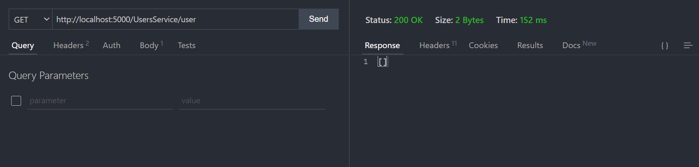
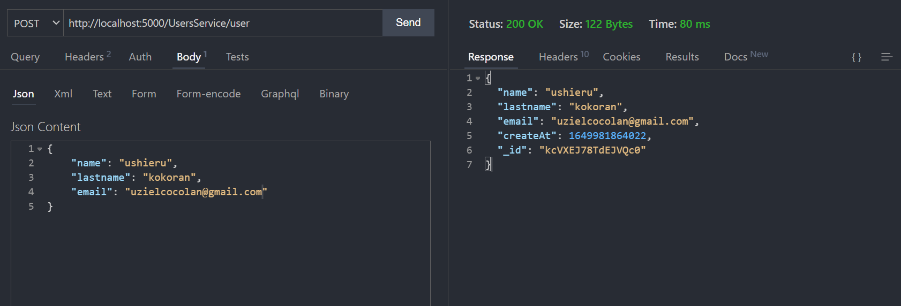
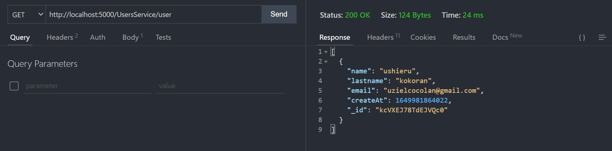

# Serendipia
<p align="center">
  
</p>

Serendipia is a simple RESTful (Representational State Transfer) gateway service for the purpose of discovery, load balancing and failover.

## Documentation

#### Init Serendipia
```bash
# Use a default port
$ serendipia

# You can assign a port
$ serendipia --port 5000

# Or with alias
$ serendipia -p 5000
```
## How works?
#### Register MicroService
```js
// Express example
import express from 'express'
import fetch from 'node-fetch';

// ... [code]

app.listen(PORT, () => {
    const register = () => fetch('http://localhost:5000/services', {
        method: 'POST', 
        body: JSON.stringify({ service_name: 'UsersService', service_port: PORT.toString() })
    });

    // Register microservice 
    register()
    // Update microservice 
    setInterval(register, 10000)

    console.log(`Server run: http://localhost:${PORT}/`)
})
```

#### Can view the log and updates 


#### Now you only need make a request with this rules:

**[SerendipiaServer]**/**[MicroServiceName]**/**[MicroServiceURI]**

#### Example:
```js
// Express-example routes
app.get('/user', (_request, response) => {
    db.find({}, (err, docs) => {
        if (err) return response.status(400).json({})
        response.json(docs)
    })
})

app.post('/user', (request, response) => {
    const { name, lastname, email } = request.body
    if (!name || !lastname || !email) return response.status(400).json({})
    const user = {
        name, lastname, email,
        createAt: Date.now()
    }
    db.insert(user, (err, doc) => {
        if (err) return response.status(500).json({})
        return response.json(doc)
    })
})
```

#### Serendipia => *localhost:5000*
#### UsersService => *localhost:3000*
#### Get Users

#### Create User

#### Get Users (Again)


The user microservice is running on port 3000 but I am still making my requests on port 5000. Serendipia will be in charge of loadbalancing (if we register more than one microservice) and pass my request to the corresponding microservice (identified with the name).

### Micreservices registered

You can see the registered microservices grouped by name.

```js
// http://localhost:5000/

{
  "UsersService": [
    {
      "name": "UsersService",
      "version": "1.0.0",
      "ip": "127.0.0.1",
      "port": "3000",
      "timestamp": 1649982433
    }
  ]
}
```

## In progress
- [ ] Version support
